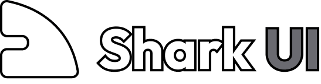

  

  <em>shadcn-style components built on Ark UI</em>

---

## Documentation

Visit http://shark-ui.com/docs to view the documentation.

## Why shark-ui

- **Familiar**: Same look and DX as shadcn/ui: CLI, registry, copy-paste.
- **Ark UI**: Accessibility and behavior from Ark UI (WAI-ARIA, keyboard, focus).
- **Own the code**: Components live in your repo; customize freely.
- **Tailwind**: Styled with Tailwind CSS and `tailwind-variants`.

## Acknowledgments

Shark UI builds on [Ark UI](https://ark-ui.com), [shadcn CLI](https://ui.shadcn.com), [Tailwind CSS](https://tailwindcss.com), and [Fumadocs](https://fumadocs.dev).

## Development

| Command               | Description                                                         |
| --------------------- | ------------------------------------------------------------------- |
| `pnpm dev`            | Docs site (`next dev`)                                              |
| `pnpm build`          | `registry:build` + `theme:build` + production Next.js build         |
| `pnpm typecheck`      | Production Next.js build (typecheck). Slow.                         |
| `pnpm test`           | Node test runner for files under `test/`                            |
| `pnpm lint:check`     | Lint (Ultracite/Biome)                                              |
| `pnpm lint:fix`       | Auto-fix lint issues                                                |
| `pnpm registry:build` | Rebuild `public/r/*.json` from manifests                            |
| `pnpm theme:build`    | Generate `styles/themes.css` from `scripts/build-themes.mts`        |

Do not hand-edit generated `public/r/*.json` or `styles/themes.css`. Full contributor workflow: see [CONTRIBUTING.md](CONTRIBUTING.md).

## License

Licensed under the [MIT license](LICENSE.md).
